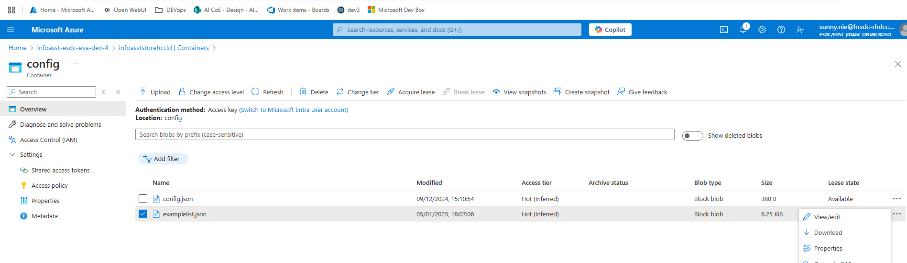
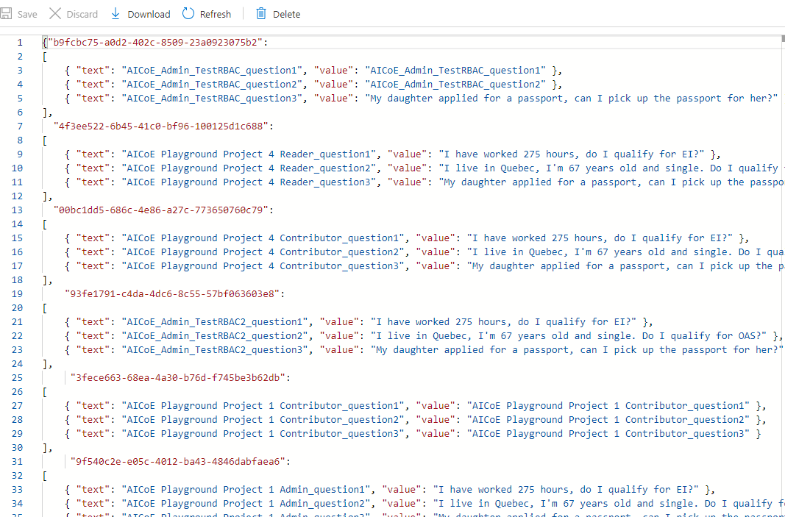
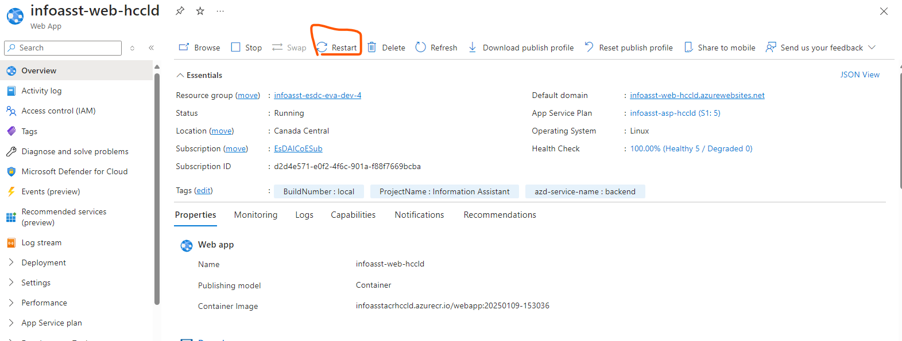
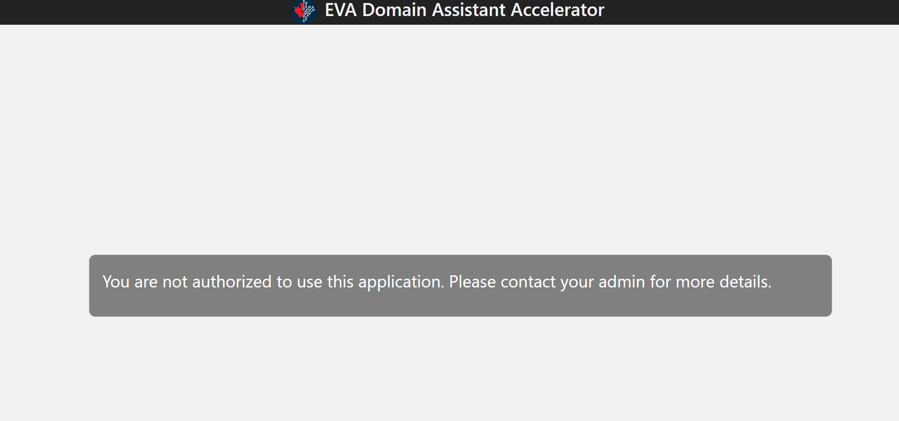
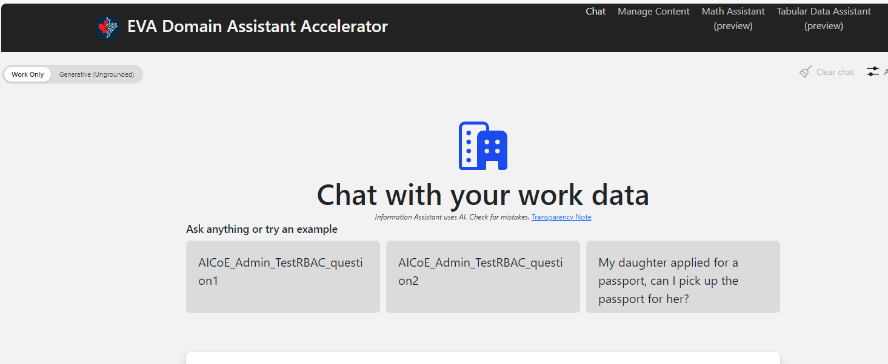

# Overview

This Design is based on the document: https://014gc.sharepoint.com/:w:/r/sites/AICoE/_layouts/15/Doc.aspx?sourcedoc=%7B80F31883-DE4A-46A6-8197-145E378BF052%7D&file=RBAC_In_Assitant.docx&action=default&mobileredirect=true

# Fetch Groups of Users

For requests related to document processing, the requests need to include user information. The current application is using Azure AD SSO for user authentication. After successful authentication, a cookie named `AppServiceAuthSession` will be included in each subsequent request sent to Azure for authentication. Azure then inserts the `x-ms-client-principal` and `x-ms-token-aad-id-token` headers. To include group information in these headers, the following configuration is needed:

## Steps to Configure Group Claims in Azure AD

### Step 1: Configure Group Claims in Azure AD App Registration

- Navigate to **Azure AD App Registrations**:
  - Go to the Azure Portal and navigate to **Azure Active Directory > App registrations**.
  - Select your application.

### Step 2: Configure Token Claims

- Under the **Manage** section on the left-hand menu, click **Token configuration**.
- Click **+ Add groups claim**.

### Step 3: Select Group Types

- Choose which group information you want to include:
  - **Security groups**: This will include the Azure AD group IDs (or names if configured) the user belongs to.
  - **All groups**: This will include both security and distribution groups.

### Step 4: Choose Token Types

- Select the **ID token** and/or **Access token** options depending on where you want the group claims to appear.

### Step 5: Include Group Names (Optional)

- Optionally, select **Group display name** to include the actual names of the groups instead of (or in addition to) their IDs.

### Step 6: Save Configuration

- Once you've configured the groups claim, **save** the configuration.

## Enable Server-Side Token Storage

To overcome the limitations of client-side cookies, you will need to enable server-side token storage.

### Steps to Enable the Token Store

1. Go to your **App Service** in the Azure Portal.
2. Navigate to **Authentication** under the **Settings** section.
3. Ensure that **Token Store** is enabled. This allows Easy Auth to store tokens securely on the server.

# Create Cosmos DB to Track the Map of AD Group, Blob Container, and Vector Index
**NOTICE: Cosmos DB Built-in Data Contributor is required to read/write data from cosmos DB** 
## Following the Steps to assign the role
1. Install Azure Command-Line Interface (CLI) [https://learn.microsoft.com/en-us/cli/azure/]
2. In terminal:   
```t
az cosmosdb sql role assignment create --account-name "<cosmosDbAccountName>" --resource-group "<resourceGroupName>" --scope "/" --principal-id "<principalIdOfResourceThatNeedsAccess>" --role-definition-name "Cosmos DB Built-in Data Contributor"
```
## Following the Steps to Create the DB **groupsToResourcesMap**

1. **Navigate to Cosmos DB Account**:
    - Use **Data Explorer**:
    - Click on **Data Explorer** in the left-hand menu.
    
2. **Add New Database**:
    - Click on **New Database**.
    - Provide a **Database ID** groupsToResourcesMap.
    - Throughput choose Autoscale and put Maximum RU/s required by this resource at 1000.

3. **Confirm Creation**:
    - Click **OK** to create the database.

4. **Creating a New Container**:
    - **Select Database**:
        - In **Data Explorer**, expand the database where you want to add the container.
    - **Add New Container**
        - Click on **New Container**.

5. **Configure Container Settings**:
    - Provide a **Container ID** `groupResourcesMapContainer`.
    - Set the **Partition Key** `/group_id`.
    

6. **Confirm Creation**:
    - Click **OK** to create the container.

## Add the item 
items shall have the following format :

```t
{
    "id": "a6410dd0-debe-4379-a164-9b2d6147eb05",
    "group_id": "a6410dd0-debe-4379-a164-9b2d6147eb05",
    "group_name": "AICoE_Contributor_TestRBAC",
     "upload_storage": {
        "upload_container": "upload1",
        "role": "Storage Blob Data Owner"
    },

    "blob_access": {
        "blob_container": "content1",
        "role_blob": "Storage Blob Data Contributor"
    },

    "vector_index_access": {
        "index": "testrbck",
        "role_index": "Search Index Data Contributor"
    },
}
```
## set the timer to refresh the cache
The following timer shall be set to refresh the cache, if group to resource mapping is updated, the CACHETIMER  is the time in seconds to refresh the cache, so if the group to resource mapping is not changed frequently, the value can be set to a higher value, the default value is 3600 seconds.
```t
CACHETIMER=3600
```
## The other environment variables
```t
COSMOSDB_DATABASE_GROUP_MAP=groupsToResourcesMap
COSMOSDB_CONTAINER_GROUP_MAP=groupResourcesMapContainer
COSMOS_FILENAME_LEN=115

```
## New azure functions triggered by event grid
RBAC introduced new azure function: fileUploadedEtrigger. This function is triggered by event grid, please make sure the event grid is configured 
to trigger this function when a file is uploaded to the blob container. 

## Multi-group handling 

the system supports handling single group in an RBAC-related context. When a user belongs to multiple RBAC groups, the selection of which group the user will operate under follows these rules:

The group with the highest role level takes precedence.
If multiple groups share the highest role (for example, multiple groups with an admin role), then alphabetical order is used to break the tie.
For example, consider this set of groups:
Admin: {AICoE_Admin_TestRBAC, AICoE_Admin_TestRBAC2}
Reader: {AICoE_Reader_TestRBAC2}
In this case, so the user will ultimately operate under AICoE_Admin_TestRBAC

## Rules to generate RBAC group 

The name of RBAC groups shall contains the roles information : for the group of admin, name shall contain "admin" like "AICoE Playground Project 3 Admin"
for group of contributor, name shall contain"contributor" like AICoE Playground Project 3 Contributor
for group of reader, name shall contain"AICoE Playground Project 4 Reader"

## Customize the example questions

For every group. the example questions can be different, the example questions can be customized, here is the steps: 
- 1 Login to azure portal: portal.azure.com
- 2 Locate the following json file examplelist.json in Storage Account , Containers/config, see picture below

- 3 Click the '...' on the right hand side of the Json file and click edit, you will see the content of the file

- 4 Find the group you belows by "text" and edit the "value" . After finish the editing, click save to save the change
- 5 Go to Web App "infoasst-web-xxxxx" (xxxxx is instance name) in azure portal, restart the web app, wait for around 5 minutes for the web app to recover 

- Relaunch the website you shall see the updated questions

# USER's GUILD
- 1. Make sure you have been assigned to a project. If your project is not created, you might contact IT support to create the project. Creating project means
an Azure group, corresponding Blob container, vector index specific for your project will be created and DB groupsToResourcesMap will be updated (Please see the section 
Create Cosmos DB to Track the Map of AD Group, Blob Container, and Vector Index)
if you see the following page means you have not been assigned to any project
, 

- 2. You should see the following page when you have been successfully assigned to a project. 
